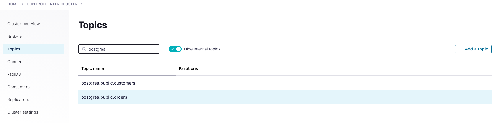

# Streaming-ETL-Demo - Enriching event stream data with CDC data from Postgres, stream into Elasticsearch
Streaming ETL Demo artifacts
<div align="center" padding=25px>
    
</div>

# <div align="center">Streaming ETL with Confluent</div>
## <div align="center">Lab Guide</div>

## **Pre-reqs**
* `git`
* `jq`
* Docker
* Confluent Cloud Account
    * Sign-up for a Confluent Cloud account [here](https://www.confluent.io/confluent-cloud/tryfree/).
    * Once you have signed up and logged in, click on the menu icon at the upper right hand corner, click on “Billing & payment”, then enter payment details under “Payment details & contacts”.

    > **Note:** You will create resources during this workshop that will incur costs. When you sign up for a Confluent Cloud account, you will get up to $200 per month deducted from your Confluent Cloud statement for the first three months. This will cover the cost of resources created during the workshop.

* Ports `443` and `9092` need to be open to the public internet for outbound traffic. To check, try accessing the following from your web browser:
    * portquiz.net:443
    * portquiz.net:9092

## **Steps**
1. [Log Into Confluent Cloud](#step-1)
2. [Create an Environment and Cluster](#step-2)
3. [Create a Schema Registry Instance](#step-3)
4. [Setup ksqlDB](#step-4)
5. [Create a Topic using the Cloud UI](#step-5)
6. [Create an API Key Pair](#step-6)
7. [Start Debezium connector, Postgres instance and Elasticsearch cluster in docker](#step-7)
8. [Set up and connect self managed debezium connector to Conlfuent Cloud](#step-8)
## Load
9. [Insert data into Postgres tables](#step-9)
10. [Check messages in Conlfuent Cloud](#step-10)
## Transform
11. [Enrich and Transform the data using ksqlDB](#step-11)
## Load
12. [Load the data into ElasticSearch](#step-12)
13. [Clean Up Resources](#step-13)
14. [Confluent Resources and Further Testing](#confluent-resources-and-further-testing)

***

## **Architecture Diagram**

<div align="center">
    
</div>

## **Objective**

In this workshop you will learn how Confluent Cloud can enable you to quickly and easily stand up a streaming ETL pipeline. During this workshop you’ll get hands-on experience with building out an end-to-end ETL pipeline; from extracting & loading data from out-of-the-box source & target systems with connectors to transforming the data in real-time with ksqlDB in Confluent Cloud. The use case will be centered around loading the data of customers purchases from Postgres into Confluent, transform and enrich the data for real time insights and then easily loading it in the destination application.

This workshop is perfect for those looking to build the foundation for your data processing pipeline and ETL use cases and to get started with Confluent Cloud. 

***

## <a name="step-1"></a>Step 1: Log Into Confluent Cloud

1. First, access Confluent Cloud sign-in by navigating [here](https://confluent.cloud).
1. When provided with the *username* and *password* prompts, fill in your credentials.
    > **Note:** If you're logging in for the first time you will see a wizard that will walk you through the some tutorials. Minimize this as you will walk through these steps in this guide.

***

## <a name="step-2"></a>Step 2: Create an Environment and Cluster

An environment contains Confluent clusters and its deployed components such as Connect, ksqlDB, and Schema Registry. You have the ability to create different environments based on your company's requirements. Confluent has seen companies use environments to separate Development/Testing, Pre-Production, and Production clusters.

1. Click **+ Add environment**.
    > **Note:** There is a *default* environment ready in your account upon account creation. You can use this *default* environment for the purpose of this workshop if you do not wish to create an additional environment.

    * Specify a meaningful `name` for your environment and then click **Create**.
        > **Note:** It will take a few minutes to assign the resources to make this new environment available for use.

1. Now that you have an environment, let's create a cluster. Select **Create Cluster**.
    > **Note**: Confluent Cloud clusters are available in 3 types: **Basic**, **Standard**, and **Dedicated**. Basic is intended for development use cases so you should use that for this lab. Basic clusters only support single zone availability. Standard and Dedicated clusters are intended for production use and support Multi-zone deployments. If you’re interested in learning more about the different types of clusters and their associated features and limits, refer to this [documentation](https://docs.confluent.io/current/cloud/clusters/cluster-types.html).

    * Choose the **Basic** cluster type.

    * Click **Begin Configuration**.

    * Choose **GCP** as your Cloud Provider and your preferred Region.
        > **Note:** GCP is required as your Cloud Provider since you will be utilizing the fully-managed BigQuery sink connector for this workshop

    * Specify a meaningful **Cluster Name** and then review the associated *Configuration & Cost*, *Usage Limits*, and *Uptime SLA* before clicking **Launch Cluster**.

***

## <a name="step-3"></a>Step 3: Create a Schema Registry Instance

A topic contains messages, and each message is a key-value pair. The message key or the message value (or both) can be serialized as JSON, Avro, or Protobuf. A schema defines the structure of the data format.

Confluent Cloud Schema Registry is used to manage schemas and it defines a scope in which schemas can evolve. It stores a versioned history of all schemas, provides multiple compatibility settings, and allows schemas to evolve according to these compatibility settings. It is also fully-managed.

1. Return to your environment by clicking on the Confluent icon at the top left corner and then clicking your environment tile.

1. Click on **Schema Registry**. Select your cloud provider and region, and then click on **Enable Schema Registry**.

***

## <a name="step-4"></a>Step 4: Setup ksqlDB

1. On the navigation menu, select **ksqlDB** and click **Create application myself**.

1. Select **Global Access** and then **Continue**.

1. Name your ksqlDB application and set the streaming units to

1. Click **Launch Application**!
> **Note:** A streaming unit, also known as a Confluent Streaming Unit (CSU), is the unit of pricing for Confluent Cloud ksqlDB. A CSU is an abstract unit that represents the linearity of performance.

***

## <a name="step-5"></a>Step 5: Create 2 Topic using the Cloud UI

1. On the navigation menu, select **Topics** and click **Create Topic**.
    > **Note:** Refresh the page if your cluster is still spinning up.

1. Enter **postgres.public.customers** as the Topic name and **1** as the Number of partitions
    > **Note:** Topics have many configurable parameters that dictate how Confluent handles messages. A complete list of those configurations for Confluent Cloud can be found [here](https://docs.confluent.io/cloud/current/using/broker-config.html).  The Debezium CDC connector for Postgres requires the topic to be created with the scheme of ${database.server.name}.${schema.name}.${table.name}. If using the default public schema, it can not be omitted, i.e. topic has to be something like Postgres.public.customers in this case.

1. Click **Create with defaults**.

    * **customers** is the name of one of the customer table in Postgres and Postgres is the database server name within the Postgres db that you will be sourcing data from.

1. Repeat the process and create another topic **postgres.public.orders** for the orders table.

***


## <a name="step-6"></a>Step 6: Create an API Key Pair

1. Select **API keys** on the navigation menu.

1. If this is your first API key within your cluster, click **Create key**. If you have set up API keys in your cluster in the past and already have an existing API key, click **+ Add key**.

1. Select **Global Access**, then click Next.

1. Save your API key and secret - you will need these during the workshop.

1. After creating and saving the API key, you will see this API key in the Confluent Cloud UI in the **API keys** tab. If you don’t see the API key populate right away, refresh the browser.

***

## <a name="step-7"></a>Step 7: Start Debezium connector, Postgres instance and Elasticsearch cluster in docker

1. To begin setting up the debezium, you should have already cloned the repository during the Prerequisites step. 
    > **Note:** This repository contains **all** the files to recreate this demo in your environment. 
    ```bash
    # Clone the ETL streaming demo repo
    git clone <>
    ```
    This directory contains two important supporting files, `setup.properties` and `docker-compose.yml`. 

    You will use `setup.properties` in order to export values from your Confluent Cloud account as environment variables. `docker-compose.yml` will use the environment variables from there to create four containers: `connect`, `control-center`, `elastic` and `postgres`. 

    You will use `control-center` to configure `connect` to do change data capture from `postgres` before sending this data Confluent Cloud. 

1. The next step is to replace the placeholder values surrounded in angle brackets within `setup.properties`. For reference, use the following table to fill out all the values completely.

    | property               | created in step                         |
    |------------------------|-----------------------------------------|
    | `BOOTSTRAP_SERVERS`      | [*create an environment and cluster*](#create-an-environment-and-kafka-cluster) |
    | `CLOUD_KEY`              | [*create an api key pair*](#create-an-api-key-pair)                  |
    | `CLOUD_SECRET`           | [*create an api key pair*](#create-an-api-key-pair)                  |
    | `SCHEMA_REGISTRY_KEY`    | [*enable schema registry*](#enable-schema-registry)                  |
    | `SCHEMA_REGISTRY_SECRET` | [*enable schema registry*](#enable-schema-registry)                  |
    | `SCHEMA_REGISTRY_URL`    | [*enable schema registry*](#enable-schema-registry)                  |

1. View the **docker-compose.yml**. 

    This will launch a PostgreSQL database, Elastic cluster and 2 Confluent Platform components - a Connect cluster and Confluent Control Center. Control Center is used to monitor your Confluent deployment. The file will not provision the brokers because you will be using the cluster you created in Confluent Cloud.

    The docker-compose.yml also has parameterized the values to connect to your Confluent Cloud instance, including the bootstrap servers and security configuration. You could fill in these Confluent Cloud credentials manually, but a more programmatic method is to create a local file with configuration parameters to connect to your clusters. To make it a lot easier and faster, you will use this method.

The docker-compose.yml file will start the Confluent Control Center, Connect Cluster, Postgres database and Elastic cluster as containers running in your docker environment. Start the environment with the below command.

```bash
source setup.properties
docker-compose up -d
```
Check whether all the containers are up using the below command

```bash
docker ps
```

Validate your credentials to Confluent Cloud Schema Registry.
```bash
curl -u $SCHEMA_REGISTRY_BASIC_AUTH_USER_INFO $SCHEMA_REGISTRY_URL/subjects
```
If successful, your output will return: `[ ]%`
    
## <a name="step-7"></a>Step 8: Set up and connect self managed debezium connector to Conlfuent Cloud

Let’s say you have a database, or object storage such as AWS S3, Azure Blob Storage, Elasticsearch cluster or Google Cloud Storage, or a data warehouse such as Snowflake. How do you connect these data systems to your architecture?

There are 2 options:

Develop your own connectors using the Kafka Connect framework (this requires a lot of development time and effort).
You can leverage the 180+ connectors Confluent offers out-of-the-box which allows you to configure your sources and sinks in a few, simple steps. To view the complete list of connectors that Confluent offers, please see Confluent Hub.
With Confluent’s connectors, your data systems can communicate with your services, completing your data pipeline.

If you want to run a connector not yet available as fully-managed in Confluent Cloud, you may run it yourself in a self-managed Connect cluster and connect it to Confluent Cloud. Please note that Confluent will still support any self managed components.

Now that you have completed setting up your Confluent Cloud account, cluster, topic, and Schema Registry, this next step will guide you how to configure a local Connect cluster backed by your cluster in Confluent Cloud that you created earlier.

You have seen and worked within the Confluent Cloud Dashboard in the previous steps. Because you have Confluent Platform services deployed, you can use Confluent Control Center (C3) to manage and monitor Confluent Platform, and it is also connected to Confluent Cloud from your set up. You will see confirmation that Control Center is indeed connected to Confluent Cloud by the end of this step.

1. Open a browser and go to **http://localhost:9021/** to access Confluent Control Center.

    <div align="center">
       
    </div>

    You will notice that the UI looks very similar to the Confluent Cloud dashboard. 

2. Click on the cluster, then click on **Topics**, and you should notice the **postgres.public.customers** and **postgres.public.orders** topic that you had created in Confluent Cloud in Step 3. This is your first confirmation that Control Center and local Connect cluster are successfully connected to Confluent Cloud.
    
    <div align="center">
       
    </div>

3. Click on **Connect**. You will see a cluster already here named **connect**. If not, please refresh the page. This is your local Connect cluster that you have running in Docker. 

    <div align="center">
       
    </div>

4. Click on **connect**, **Add Connector**, and then on the **PostgresConnector Source** tile. 

    <div align="center">
       
    </div>

